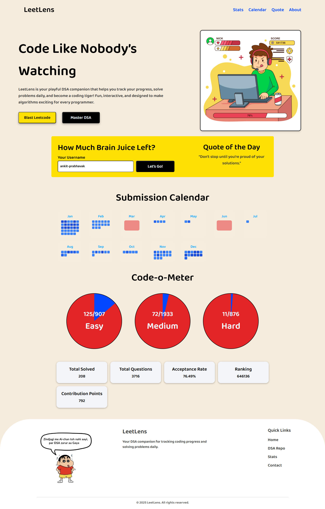

# 💡 LeetLens

> **Code Like Nobody’s Watching.**  
> LeetLens is your playful **DSA companion** that helps you track your **LeetCode stats**, view progress visually, and stay motivated with random DSA quotes.

---

## 📸 Preview

*(Add your full-page screenshot here after capturing it)*  


---

## Features

- **Search any LeetCode user** and fetch live stats using the LeetCode Stats API  
- **Dynamic progress circles** showing Easy, Medium, and Hard problem progress  
- **Random motivational quotes** for every refresh  
- **Submission calendar** visualizing your activity  
- **Responsive design** with transparent mobile menu and overlay  
- **Smooth animations** and modern UI inspired by coding dashboards  

---

## Tech Stack

| Frontend | Backend / API | Styling |
|-----------|----------------|----------|
| HTML5 | [LeetCode Stats API](https://leetcode-stats-api.herokuapp.com/) | CSS3 (Flexbox, Media Queries) |
| JavaScript (ES6) | Fetch API | Custom Variables, Responsive Layout |

---

## ⚙️ How It Works

1. User enters a **LeetCode username** and clicks **“Let’s Go!”**  
2. The app fetches live user data from `https://leetcode-stats-api.herokuapp.com/{username}`  
3. It then displays:
   - Total questions and solved count  
   - Difficulty breakdown with progress rings  
   - Acceptance rate, ranking, and contribution points  
   - Submission calendar heatmap  

---

## 💻 Usage

1. Clone the repo:

   ```bash
   git clone https://github.com/your-username/LeetLens.git
   cd LeetLens
